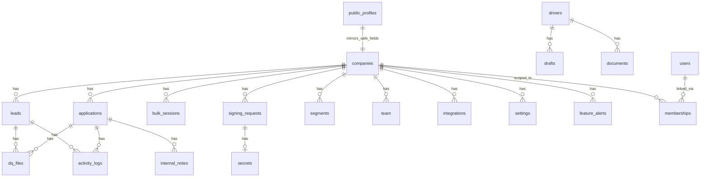

# Firestore Data Model

Derived from [`src/firestore.rules`](../src/firestore.rules) (deployed with hosting) and backend usage in `functions/`. This document reflects **security-rule coverage** and **observed collection paths** in code—not an exhaustive audit of every field on every document.

**Legend**

| Access | Meaning |
|--------|---------|
| **public** | Unauthenticated read allowed |
| **team** | `isCompanyTeam(companyId)` — `company_admin`, `hr_user`, `recruiter`, or super admin |
| **admin** | `isCompanyAdmin(companyId)` or super admin |
| **owner** | Document owner (`request.auth.uid`) |
| **server** | No client rule match → default **deny**; Cloud Functions use Admin SDK |
| **super** | `isSuperAdmin()` only |

---

## Entity relationship (high level)

---

## Top-level collections

| Collection | Document ID | Client access (summary) | Purpose |
|------------|-------------|-------------------------|---------|
| `companies` | `companyId` | **get:** team or super · **list:** super only · **create/delete:** super · **update:** admin+ | Tenant root: branding, `features`, `featureSchedules`, `applicationConfig`, quotas, etc. |
| `public_profiles` | `companyId` | **read:** public · **write:** server (`syncPublicProfile` trigger) | Sanitized mirror for `/apply/:slug` (no revenue/internal fields) |
| `drivers` | `driverId` (= Auth uid) | **get:** owner, super, or any staff · **list:** owner or super only · **write:** owner or super | Master driver profile |
| `users` | `userId` | **read:** owner, super, staff · **create:** self · **update:** owner (no role/companyId) or super | HR/admin portal user profile |
| `memberships` | auto | **read:** self, super, company admin of tenant · **write:** super or company admin | Links `userId` ↔ `companyId` + role |
| `notifications` | auto | **read/update/delete:** recipient · **create:** denied (server-only) | Per-user inbox |
| `verification_requests` | token | **read:** super only · **write:** denied | PEV; all portal access via callables |
| `verification_requests/{token}/responses` | `responseId` | same as parent | PEV responses |
| `analytics` | `docId` | **read:** super · **write:** denied | Platform analytics |
| `system_settings` | `settingId` | **read:** staff or super · **write:** super | Global settings |
| `recruiter_links` | `code` | **read:** public · **create/update:** super, or team **of the company stamped on the link** (`companyId` immutable) · **delete:** super | Recruiter attribution URLs. SEC-003: any staff from any company could previously create or overwrite any link code |
| `job_posts` | `postId` | **server** (no rule → default deny) | **Retired.** The public job board was removed (commit `5a4c8dd`) and the former public-read / company-team-write rules were **deleted**. Historical documents are left unreachable rather than deleted. `firestore.rules.security.test.js` has a default-deny regression test |

### Server-only top-level (no rules → client denied)

Used by Cloud Functions with Admin SDK:

| Collection | Purpose |
|------------|---------|
| `blacklist/{phone}` | Global SMS opt-out |
| `rate_limits/{key}` | Token-bucket rate limiting |
| `processing_status/{id}` | Trigger idempotency (e.g. `app_{companyId}_{appId}`) |
| `orphaned_signature_cleanup` | Digital sealing maintenance |
| `environment_audit_log/{id}` | Super Admin Environment & Integrations vault audit trail. Written only by the vault callables; `src/firestore.rules` denies every client read and write, **including Super Admins**, so it cannot be forged or read around the callable. Fields: `actorUid`, `actorEmail`, `action`, `result`, `entryId`, `key`, `integration`, `scope`, `companyId`, `source`, `category`, `sensitivity`, `availability`, `reason`, `valueLength`, `timestamp`. It never stores a plaintext value, ciphertext, a partial value or a token fragment — see [`functions/environmentVault/audit.js`](../functions/environmentVault/audit.js). |

---

## `companies/{companyId}` subcollections

| Subcollection | Access (summary) | Notes |
|---------------|------------------|-------|
| `templates/{id}` | read: team · write: admin | Hiring offer/form templates |
| `message_templates/{id}` | read: team · write: admin | Campaign message templates |
| `bulk_sessions/{id}` | read/write: team | Bulk SMS/email sessions |
| `bulk_sessions/{id}/logs/{id}` | read: team | Per-message send logs |
| `campaign_drafts/{id}` | read/write: team | Campaign wizard persistence |
| `segments/{id}` | read: team · write: admin | Smart segments |
| `segments/{id}/members/{id}` | read: team · write: admin | Segment membership |
| `stats_daily/{dateId}` | read: team | Aggregated daily stats (server-written) |
| `internal_stats/{docId}` | read: team · write: **denied** | Dashboard KPI rollups (server-only writes) |
| `notifications/{id}` | read: team · create: admin · update: team · delete: admin | Company-scoped notifications |
| `feature_alerts/{id}` | read/write: team or super | Scheduled deactivation warning analytics |
| `system_settings/email_config` | read/write: admin | SMTP credentials (sensitive) |
| `settings/{docId}` | read: team · write: admin | Custom questions, ATS SMS templates, etc. |
| `signing_requests/{id}` | read: team, recipient, super · create: team · update: team or recipient (limited fields) · delete: admin | E-sign envelopes |
| `signing_requests/{id}/secrets/{id}` | create: team · read/update/delete: **denied** | `accessToken`; Functions only after create |
| `applications/{applicationId}` | see below | Core applicant record |
| `leads/{leadId}` | team read/write with `companyId` immutability + ATS status enums | CRM leads |
| `team/{userId}` | read: team · write: admin | Company roster metadata |
| `integrations/{integrationId}` | read/update: admin · create/delete: super | Encrypted SMS provider config |

### Server-only company subcollections (no rules)

| Path | Purpose |
|------|---------|
| `companies/{id}/blacklist/{phone}` | Company opt-out list |
| `companies/{id}/inbound_messages/{id}` | Inbound SMS (STOP handling trigger) |
| `companies/{id}/application_drafts/{applicantKey}` | An unfinished driver application, saved after each Next. See below |
| `companies/{id}/application_draft_audit/{id}` | Value-free records of resume-match attempts and discards |

---

## `applications/{applicationId}` (under company)

| Operation | Who |
|-----------|-----|
| **create** | **Signed-in** driver with deterministic ID (`applicationId == applicantId` and `companyId` matching the path); or company team / super (manual entry, also tenant-bound). **Guests have no create branch at all** (SEC-004) |
| **read** | Team, applicant/owner driver, email-verified owner, super |
| **update** | Team (ATS status in allowlist); driver self-update on **allowlisted fields** only, with allowed status transitions; super. `companyId` is immutable for everyone |
| **delete** | Admin or super |

**Subcollections**

| Subcollection | Access |
|---------------|--------|
| `dq_files`, `general_documents` | read: team, super, or owner fields on doc · write: team, super |
| `internal_notes`, `activity_logs`, `activities` | read/write: team, super |
| `pending_changes/{fieldKey}` | read: team, super · **write: denied**. Company-proposed edits awaiting driver approval; written only by the `proposeApplicationChanges` / `submitChangeResolution` callables |
| `submission/{version}` | read: team, super, owner · **write: denied**. The frozen snapshot of exactly what the driver saw, answered and accepted. Server-only (Admin SDK) — this denial is what makes it immutable rather than merely intended to be |

**Deterministic IDs:** doc ID = truncated SHA-256 of `companyId:email:phone` (see [`src/lib/applicationId.js`](../src/lib/applicationId.js)), which makes offline-queue retries idempotent upserts instead of duplicates. **Guest submissions go exclusively through the `submitGuestApplication` callable** (Admin SDK, which bypasses these rules); there is no unauthenticated client-write fallback.

---

## `application_drafts/{applicantKey}` (under company)

An application in progress. **Server-only** — `allow read, write: if false` for
every client including Super Admins — reached only through the four guest
callables in [`functions/applicationDrafts.js`](../functions/applicationDrafts.js)
and the staff-facing `listApplicationDrafts`.

It is a **separate collection from `applications` on purpose.** Four triggers fire
on `create` under `companies/{id}/applications/{appId}`:
`onNewApplicationNotification`, `onNewApplicationEmailConfirmation`,
`onApplicationSubmitted` (driver sync / shadow profile) and the stats rollup.
Writing drafts there would email every half-finished applicant "we received your
application" and create driver profiles for people who typed a name and left.

The document id is the **existing deterministic applicant key** —
`sha256(companyId:email:phone)` truncated to 20 hex, from
[`functions/shared/buildApplicationDoc.js`](../functions/shared/buildApplicationDoc.js)
— so a draft and the application it becomes share one identity and repeated saves
merge idempotently. No new identity scheme was introduced.

| Field | Notes |
| --- | --- |
| `companyId`, `applicantKey`, `applicantKeyFull` | Tenant binding and the id, as `applications` stores them |
| `contactEmail`, `contactPhone` | Normalized, so a resume can require one of them without reading the whole document |
| `identityKey` | **A keyed HMAC** of company + normalized last name + date of birth + SSN digits, derived server-side from `SMS_ENCRYPTION_KEY` under its own purpose string. Null when the identity is incomplete |
| `formData` | The answers so far, allowlisted and size-capped. `ssn` and `signature` are stripped **at every depth** |
| `lastStep`, `lastSemanticStep` | Where to return the applicant. The semantic id is what survives a company's custom-questions step being present or absent |
| `clientSeq` | The browser's own write counter for the copy this save carried. The client compares it with the sequence *it* believes is synced, which is how an older server draft is stopped from overwriting newer local work — without either side comparing a phone clock to a Firestore timestamp. Null for a draft written before the field existed; the client falls back to comparing progress |
| `resumeTokenHash` | A hash of the bearer token issued to a browser. Compared in constant time; the token itself is never stored |
| `status`, `createdAt`, `updatedAt`, `expiresAt` | 30-day TTL declared in `firestore.indexes.json` |

**The draft never holds an SSN.** It is stripped in three independent places — the
local browser draft, the client payload, and again on arrival — and the identity
match uses the HMAC. On resume the applicant must re-enter it, and that is enforced
at submission rather than assumed: `submitGuestApplication` refuses a submission
missing a required field the draft never carried
(`assertRequiredUnpersistedFields`), driven off this strip list and `resolveGate`
so a company that hides the question or marks it Optional is respected.

**Writing a new draft is open; changing an existing one is not.** A progress save
is unauthenticated by necessity, but that allowed anyone holding an applicant's
email and phone to overwrite an existing draft, and anyone holding their name, date
of birth and SSN digits to have it superseded. A save that would modify an existing
document now requires either the `resumeTokenHash` match for this device or the full
`identityKey`; superseding *other* drafts additionally requires a token that
resolves to the same identity. The check and the write share one transaction, so
nothing can change the document between them. An unauthorized attempt consumes a
refusal budget kept per caller and per targeted draft — keyed on the applicant key,
which a caller cannot vary without attacking a different draft, and on its own keys
so it cannot exhaust the budget the real applicant needs — is audited as
`draft_write_refused` / `unauthorized_write`, and returns the same
`{ saved: false }` shape a network failure returns, so the refusal does not confirm
the document exists.

**At most one live draft per (company, identity).** A returning applicant who
retypes their email derives a second document id, and leaving both would make
"continue" a coin flip, so a save retires the others — specifically, the ones whose
own resume token the caller presents, since deleting a draft needs proof of owning
*that* draft. `startNewApplication` deletes only the draft its token resolved
to: sweeping the identity would let anyone holding the three identity facts create a
draft of their own, be given a token for it, and delete the real applicant's. That collapse is why the resume lookup runs *before* the
first save — see
[`useApplicationResume.js`](../src/features/driver-app/hooks/useApplicationResume.js).

**A save presenting a resume token that opens no live draft is refused.** The token
means "I am writing the draft I already own"; once that draft has been deleted — Start
Over in another tab, or submission — the payload predates the deletion and writing it
recreates a discarded application. Resolution is cheapest-first: the target document,
then the key the request names in `resumeApplicantKey`, then the identity's drafts,
then a bounded recent scan when no `identityKey` can be derived, all inside the same
transaction that authorizes the write. Each step falls through rather than deciding.
`resumeApplicantKey` is a hint only — the named document is accepted solely on its own
`resumeTokenHash` match, so naming another applicant's draft gains nothing — and it
exists for the save that corrects a contact field and an identity field at once, where
neither the new document id nor the new `identityKey` finds the draft the token opens.
Audited as `stale_token`.

A successful submission discards the draft (`discardDraftForApplication`), so a
completed application never leaves a resumable copy behind.

Composite index: `identityKey` ASC + `updatedAt` DESC.

`application_draft_audit/{id}` records `action` (`resume_match_attempted` for a
lookup, `draft_write_refused` for a refused update, whose `outcome` distinguishes
`unauthorized_write` from the ordinary multi-tab `stale_token`), `outcome`, `at` and
`expiresAt` —
and nothing else. Not the name, the date of birth, the SSN, the identity hash or
the contact detail. What matters operationally is how many resume attempts a
company's apply page is seeing and how many matched; a spike is visible and
nothing about a person is retained.

---

## `leads/{leadId}` (under company)

| Operation | Who |
|-----------|-----|
| **create/update** | Team or super; `companyId` must match path and stay immutable |
| **delete** | Team or super |

Same activity/DQ/note subcollections as applications (team/super).

---

## `drivers/{driverId}` subcollections

| Subcollection | Access |
|---------------|--------|
| `drafts`, `documents` | owner or super |
| `saved_jobs` | **Retired.** The driver saved-jobs / job-board feature was deleted (commit `5a4c8dd`) and its rule was removed, so the path is now default-deny |

---

## Collection group queries

Rules at end of `firestore.rules` allow cross-tenant queries when scoped by claims:

| Group | Read allowed when |
|-------|-------------------|
| `{path=**}/applications/{appId}` | super; applicant/owner; team for `resource.data.companyId` |
| `{path=**}/leads/{leadId}` | super; team for company; lead `userId` == auth uid |
| `{path=**}/activity_logs/{id}` | super; team if `companyId` is string on doc |
| `{path=**}/signing_requests/{id}` | super; recipient; team for `companyId` |

---

## RBAC helpers (rules)

| Helper | Grants |
|--------|--------|
| `isSuperAdmin()` | `globalRole == 'super_admin'` (token or nested legacy) |
| `isCompanyAdmin(companyId)` | super or `roles[companyId] == 'company_admin'` |
| `isCompanyTeam(companyId)` | super, admin, or `hr_user` / `recruiter` |
| `isStaff()` | any user with non-empty `roles` map |

Custom claims are set via `onMembershipWrite` and HR admin callables ([`functions/hrAdmin.js`](../functions/hrAdmin.js)).

---

## Shared AI platform and News & Insights (server-only)

All four are denied to every client, including Super Admins. The consoles read
them through narrow callables, so no browser needs a direct read and none can
forge a record.

| Collection | Contents | Why closed |
| --- | --- | --- |
| `ai_provider_config/{providerId}` | enabled flag, non-secret settings (Cloudflare account id, model overrides), health, consecutive failures, cooldown, last-test result | Holds no credential value, but still reveals which vendors a deployment uses and which are failing |
| `ai_telemetry/{id}` | one document per AI transaction: task type, required capabilities, outcome, latency, fallback count, final provider/model, a shape-only `inputSummary`, and a bounded `attempts[]` array recording each provider's turn (category, HTTP status, vendor code, latency, schema validity, token counts). `expiresAt` drives the 30-day TTL declared in `firestore.indexes.json`. Never prompts, images, response text or credentials | Diagnostic only; a client could otherwise forge entries or enumerate failures. Read by Super Admin through `listAiTelemetry` |
| `blog_posts/{publicationDate}_{themeId}` | title, slug, excerpt, sanitized content blocks, theme, status, sources, image licence metadata, SEO, generation record, knowledge version, duplicate-prevention fingerprints, timestamps | The article *content* is public, but the document also carries tombstones, source fingerprints and provider/model records. The public surface is the server-rendered `/news` routes, which filter to published and strip metadata |

| `blog_runs/{runId}` | one document per publication slot per run: `outcome`, the pipeline `stage` that refused, `slotKey`, `themeId`, `publicationDate`, `trigger`, safe `detail`, `slug` when something published, the generation and verification `transactionId`s, the fact-check's own `verificationSupported` verdict, provider/model/fallback count, `createdAt` and `expiresAt` (30-day TTL) | Diagnostic only, and forgeable if a client could write it. Read by Super Admin through `listBlogRuns` |

`blog_posts` uses `${publicationDate}_${themeId}` as its id deliberately: that
pair is the uniqueness constraint, so `create()` refusing a duplicate *is* the
idempotency guarantee for the publication scheduler.

No AI credential value is ever stored in Firestore. Credentials live in Google
Secret Manager - see [`docs/ai-platform.md`](./ai-platform.md).

## Related files

| File | Role |
|------|------|
| [`firestore.indexes.json`](../firestore.indexes.json) | Composite indexes |
| [`src/storage.rules`](../src/storage.rules) | Storage paths (`guest_uploads/`, company assets) |
| [`functions/companyAdmin.js`](../functions/companyAdmin.js) | `buildPublicProfileDto` — fields synced to `public_profiles` |

---

## `public_profiles` field whitelist

Synced from `companies` on write (not readable from full company doc by guests):

- `companyName`, `appSlug`, `logoUrl`, `brandColor`
- `applicationConfig` (subset of keys in `PUBLIC_APPLICATION_CONFIG_KEYS`)
- `customQuestions`
- `updatedAt`

`features` and `featureSchedules` are **not** exposed on public profiles.
